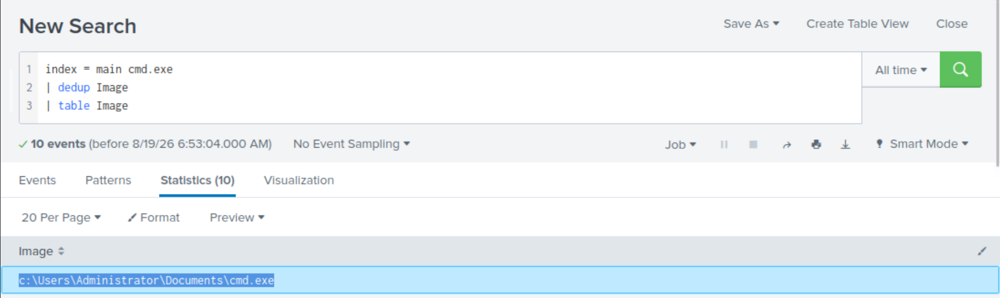
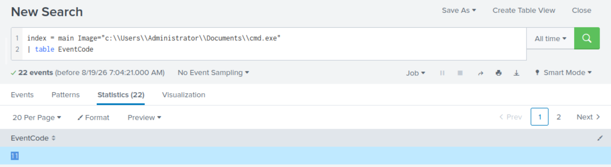
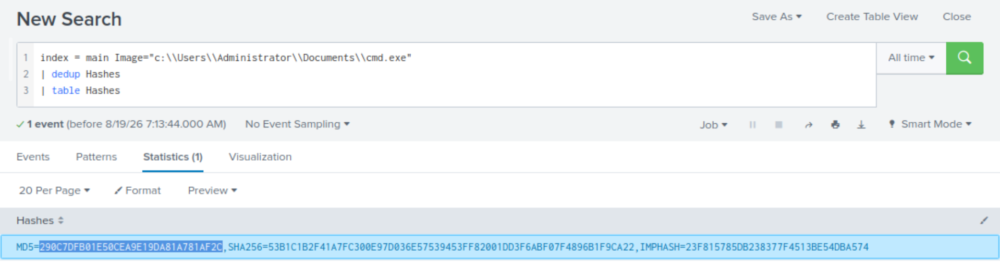
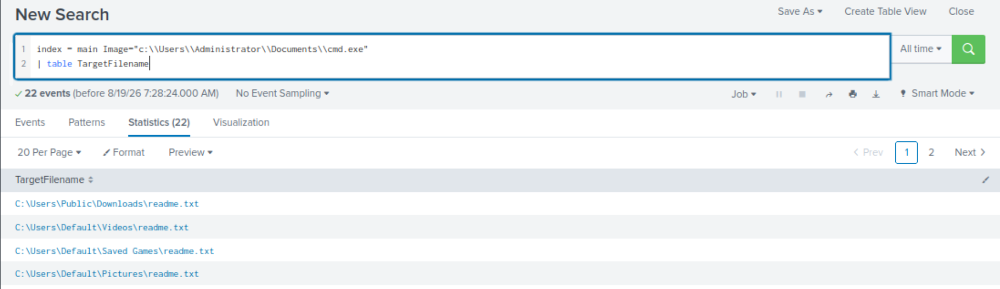
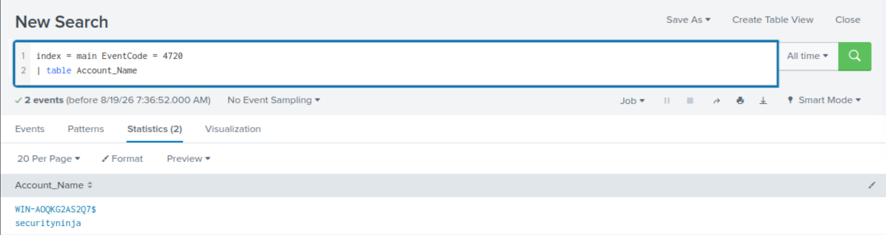
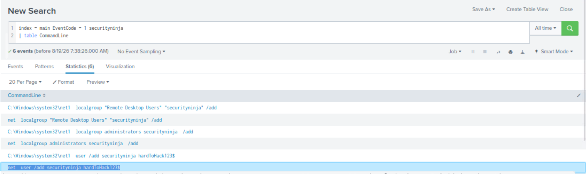
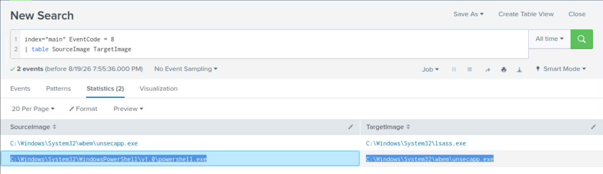
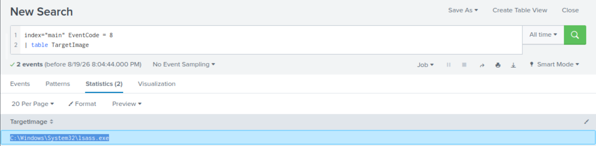
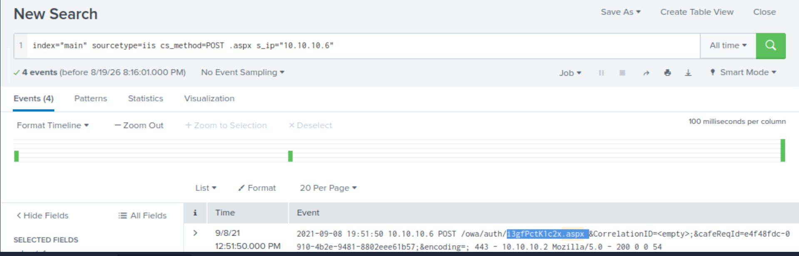
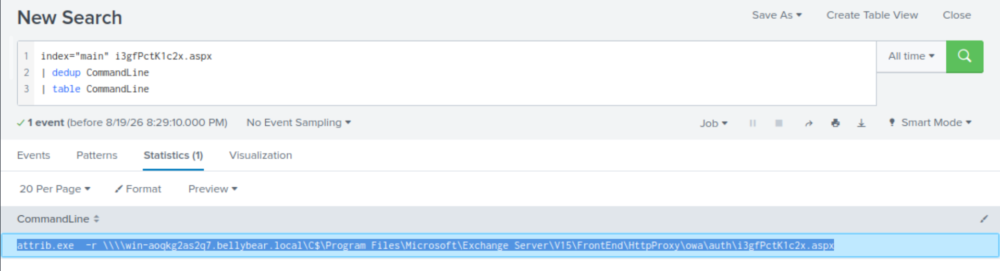

# Conti

## Overview

**Conti** is a SOC investigation challenge focused on investigating a
ransomware attack using **Splunk**. The investigation involves Windows
and IIS telemetry, Sysmon events, process activity, file creation,
account creation, process migration, web shell activity, and external
research.

------------------------------------------------------------------------

## Tools & Data Sources

-   **Splunk** 
-   **Sysmon** 
-   **IIS Logs** 
-   **Windows Event Logs** 
-   **External Research** 

------------------------------------------------------------------------

# Investigation

## Q1 --- Location of the Ransomware

### Question:

> Can you identify the location of the ransomware?

### Investigation:

The hint suggested looking for a **common Windows binary located in an
unusual location**.

I searched for `cmd.exe` activity and reviewed the `Image` field.

### Query:

``` spl
index=main cmd.exe
| dedup Image
| table Image
```


### Finding:

Among the results, `cmd.exe` appeared in an unusual user directory:

``` text
C:\Users\Administrator\Documents\cmd.exe
```

A legitimate Windows `cmd.exe` normally resides under
`C:\Windows\System32\`. Its presence in the Administrator's Documents
directory was therefore suspicious.

### Answer:

``` text
C:\Users\Administrator\Documents\cmd.exe
```

------------------------------------------------------------------------

## Q2 --- Sysmon Event ID for File Creation

### Question:

> What is the Sysmon event ID for the related file creation event?

### Investigation:

After identifying the suspicious `cmd.exe`, I searched for events
associated with that image and checked the `EventCode` field.

### Query:

``` spl
index=main Image="c:\\Users\\Administrator\\Documents\\cmd.exe"
| table EventCode
```


### Finding:

The relevant Sysmon event code was:

``` text
11
```

Sysmon Event ID **11** represents **FileCreate**, which records when a
file is created.

### Answer:

``` text
11
```

------------------------------------------------------------------------

## Q3 --- MD5 Hash of the Ransomware

### Question:

> Can you find the MD5 hash of the ransomware?

### Investigation:

I searched for the hash information associated with the suspicious
`cmd.exe`.

### Query:

``` spl
index=main Image="c:\\Users\\Administrator\\Documents\\cmd.exe"
| dedup Hashes
| table Hashes
```


### Finding:

The event contained multiple hashes, including MD5, SHA256, and IMPHASH.

The MD5 value was:

``` text
290C7DFB01E50CEA9E19DA81A781AF2C
```

### Answer:

``` text
290C7DFB01E50CEA9E19DA81A781AF2C
```

------------------------------------------------------------------------

## Q4 --- File Saved to Multiple Locations

### Question:

> What file was saved to multiple folder locations?

### Investigation:

I examined the `TargetFilename` field for events associated with the
suspicious `cmd.exe`.

### Query:

``` spl
index=main Image="c:\\Users\\Administrator\\Documents\\cmd.exe"
| table TargetFilename
```


### Finding:

The same file appeared in multiple directories, including:

``` text
C:\Users\Public\Downloads\readme.txt
C:\Users\Default\Videos\readme.txt
C:\Users\Default\Saved Games\readme.txt
C:\Users\Default\Pictures\readme.txt
```

This indicates that the ransomware created or saved the same file in
several locations.

### Answer:

``` text
readme.txt
```

------------------------------------------------------------------------

## Q5 --- Command Used to Create a New User

### Question:

> What was the command the attacker used to add a new user to the
> compromised system?

### Investigation:

I first searched for **Windows Event ID 4720**, which indicates that a
user account was created.

### Query 1:

``` spl
index=main EventCode=4720
| table Account_Name
```


The investigation revealed the account:

``` text
securityninja
```

I then searched for process creation events involving that username.

### Query 2:

``` spl
index=main EventCode=1 securityninja
| table CommandLine
```


### Finding

The command used to create the account was:

``` text
net user /add securityninja hardToHack123$
```

The attacker also added the account to privileged groups:

``` text
net localgroup administrators securityninja /add
net localgroup "Remote Desktop Users" "securityninja" /add
```

### Answer

``` text
net user /add securityninja hardToHack123$
```

------------------------------------------------------------------------

## Q6 --- Process Migration

### Question:

> The attacker migrated the process for better persistence. What is the
> migrated process image (executable), and what is the original process
> image (executable) when the attacker got on the system?

### Investigation:

The hint directed the investigation toward **Sysmon Event ID 8**.

Sysmon Event ID 8 is **CreateRemoteThread**. It can provide useful
evidence of process injection or migration activity.

I searched for Event ID 8 and compared the `SourceImage` and
`TargetImage` fields.

### Query:

``` spl
index="main" EventCode=8
| table SourceImage TargetImage
```


### Finding:

The relevant event showed:

``` text
SourceImage:
C:\Windows\System32\WindowsPowerShell\v1.0\powershell.exe

TargetImage:
C:\Windows\System32\wbem\unsecapp.exe
```

This shows the process activity moving from PowerShell into
`unsecapp.exe`.

### Answer:

``` text
C:\Windows\System32\WindowsPowerShell\v1.0\powershell.exe;C:\Windows\System32\wbem\unsecapp.exe
```

------------------------------------------------------------------------

## Q7 --- Process Used to Retrieve System Hashes

### Question:

> The attacker also retrieved the system hashes. What is the process
> image used for getting the system hashes?

### Investigation:

Again, I investigated Sysmon Event ID 8 and focused on the `TargetImage`
field:

``` spl
index="main" EventCode=8
| table TargetImage
```


### Finding:

The suspicious process was:

``` text
C:\Windows\System32\lsass.exe
```

`lsass.exe` is the **Local Security Authority Subsystem Service** and is
responsible for important Windows security functions, including handling
authentication credentials. Access to LSASS is therefore highly relevant
during credential-dumping investigations.

### Answer:

``` text
C:\Windows\System32\lsass.exe
```

------------------------------------------------------------------------

## Q8 --- Web Shell Deployed by the Exploit

### Question:

> What is the web shell the exploit deployed to the system?

### Investigation:

The hint suggested looking at **IIS logs for POST requests**.

IIS logs were identified using the `iis` sourcetype. I searched for POST
requests involving `.aspx` files and the suspicious source IP.

### Query:

``` spl
index="main" sourcetype=iis cs_method=POST .aspx s_ip="10.10.10.6"
```


One suspicious request referenced:

``` text
i3gfPctK1c2x.aspx
```

The IIS event showed the request reaching the Exchange OWA
authentication path.

### Finding:

The suspicious `.aspx` file was:

``` text
i3gfPctK1c2x.aspx
```

An `.aspx` file placed in a web-accessible directory and accessed
through POST requests is consistent with web-shell activity.

### Answer:

``` text
i3gfPctK1c2x.aspx
```

------------------------------------------------------------------------

## Q9 --- Command Line That Executed the Web Shell

### Question:

> What is the command line that executed this web shell?

### Investigation:

After identifying the web shell, I searched for its filename and
reviewed the `CommandLine` field.

``` spl
index="main" i3gfPctK1c2x.aspx
| dedup CommandLine
| table CommandLine
```


### Finding:

The command line was:

``` text
attrib.exe -r \\win-aoqkg2as2q7.bellybear.local\C$\Program Files\Microsoft\Exchange Server\V15\FrontEnd\HttpProxy\owa\auth\i3gfPctK1c2x.aspx
```

The `attrib.exe -r` command removes the **Read-only** attribute from the
file.

The path also reveals that the web shell was located inside the
Microsoft Exchange OWA authentication directory.

### Answer:

``` text
attrib.exe -r \\win-aoqkg2as2q7.bellybear.local\C$\Program Files\Microsoft\Exchange Server\V15\FrontEnd\HttpProxy\owa\auth\i3gfPctK1c2x.aspx
```

------------------------------------------------------------------------

## Q10 --- CVEs Used by the Exploit

### Question:

> What three CVEs did this exploit leverage? Provide the answer in
> ascending order.

### Investigation:

This question required external research rather than a Splunk query.

The three CVEs associated with the exploit were identified as:

``` text
CVE-2018-13374
CVE-2018-13379
CVE-2020-0796
```

### Answer:

``` text
CVE-2018-13374
CVE-2018-13379
CVE-2020-0796
```

------------------------------------------------------------------------

## Key Investigation Concepts

### Sysmon Event IDs Used

| Event ID | Meaning | Why It Mattered |
|----------|---------|------------------|
| **1** | Process Create | Used to identify commands executed by the attacker |
| **8** | CreateRemoteThread | Used to investigate process migration/injection |
| **11** | FileCreate | Used to identify ransomware file creation activity |

### Windows Event ID Used

| Event ID | Meaning |
|----------|---------|
| **4720** | A user account was created |
------------------------------------------------------------------------

# Investigation Takeaways

This room demonstrated how a SOC analyst can correlate multiple sources
of telemetry instead of relying on a single alert.

### Important lessons

-   A legitimate Windows binary in an unusual directory can be a strong
    indicator of compromise.
-   **Sysmon Event ID 11** can help identify suspicious file creation.
-   **Sysmon Event ID 1** provides valuable process and command-line
    evidence.
-   **Sysmon Event ID 8** can reveal suspicious process interaction such
    as process injection/migration.
-   **Event ID 4720** can identify newly created Windows accounts.
-   IIS **POST requests** can be useful when hunting for web shells.
-   Command-line data can reveal exactly how an attacker interacted with
    a compromised system.
-   `lsass.exe` is a high-value process when investigating
    credential-access activity.
-   External threat intelligence and CVE research can help connect
    observed activity to a known exploit chain.
-   Effective SOC investigations are based on **correlation and
    context**, not simply finding one suspicious event.

------------------------------------------------------------------------

# Conclusion

The Conti investigation demonstrated a realistic SOC workflow: starting
with a suspicious executable, tracing file activity and hashes,
identifying attacker-created accounts, investigating process migration
and credential access, and finally hunting through IIS logs for a
deployed web shell. The room reinforced the importance of **Sysmon,
Windows Event Logs, IIS telemetry, Splunk queries, and event
correlation** when investigating a ransomware intrusion.
