# PS Eclipse

## Overview

**PS Eclipse** is a Splunk-based SOC investigation challenge from TryHackMe.

A customer reported suspicious file extensions on **Keegan's machine** on **May 16, 2022**, raising concerns about a possible ransomware attack. The objective was to investigate the endpoint using Splunk and determine what occurred.

### Tools Used

* Splunk
* Sysmon
* CyberChef
* VirusTotal

---

## Investigation

### Q1 — Suspicious Binary

**Question:**
A suspicious binary was downloaded to the endpoint. What was the name of the binary?

**Investigation:**
I started with **Sysmon Event ID 22 (DNS Query)** and reviewed the `Image` field for suspicious executables.

**Query:**

```spl
index=main sourcetype="WinEventLog:Microsoft-Windows-Sysmon/Operational" EventCode=22
| table Image
```

**Finding:**

```text
C:\Windows\Temp\OUTSTANDING_GUTTER.exe
```

**Answer:** `OUTSTANDING_GUTTER.exe`

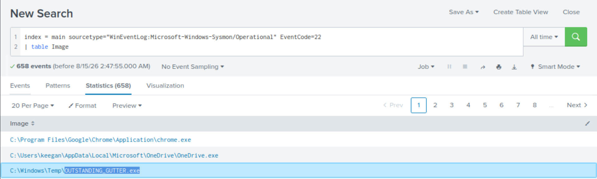

---

### Q2 — Download Source

**Question:**
What is the address the binary was downloaded from?

**Investigation:**
I continued investigating the Sysmon Event ID 22 DNS queries and reviewed the `QueryName` field to identify suspicious domains.

**Query:**

```spl
index=main sourcetype="WinEventLog:Microsoft-Windows-Sysmon/Operational" EventCode=22
| dedup QueryName
| table QueryName
```

The query returned two suspicious `ngrok.io` domains:

```text
9030-181-215-214-32.ngrok.io
886e-181-215-214-32.ngrok.io
```
I identified `886e-181-215-214-32.ngrok.io` as the relevant domain associated with the suspicious binary.

**Answer:** `hxxp[://]886e-181-215-214-32[.]ngrok[.]io`

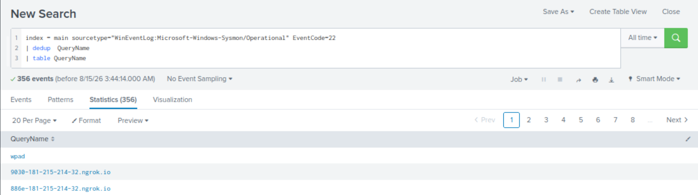


---

### Q3 — Downloading Executable

**Question:**
What Windows executable was used to download the suspicious binary?

**Investigation:**
I filtered the DNS event for the identified download domain and checked the `Image` field.

**Query:**

```spl
index=main sourcetype="WinEventLog:Microsoft-Windows-Sysmon/Operational" EventCode=22 QueryName="886e-181-215-214-32.ngrok.io"
| table Image
```

**Finding:**

```text
C:\Windows\System32\WindowsPowerShell\v1.0\powershell.exe
```

**Answer:** `C:\Windows\System32\WindowsPowerShell\v1.0\powershell.exe`

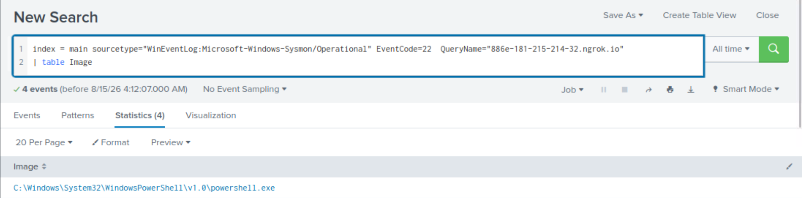

---

### Q4 — Elevated Privileges

**Question:**
What command was executed to configure the suspicious binary to run with elevated privileges?

**Investigation:**
I searched **Sysmon Event ID 1 (Process Creation)** for `OUTSTANDING_GUTTER.exe` and reviewed the `CommandLine` field.

**Query:**

```spl
index=main sourcetype="WinEventLog:Microsoft-Windows-Sysmon/Operational" EventCode=1 "OUTSTANDING_GUTTER.exe"
| table CommandLine
```

The command used `schtasks.exe` to create a scheduled task configured to run as `SYSTEM`.

**Answer:**

```text
"C:\Windows\system32\schtasks.exe" /Create /TN OUTSTANDING_GUTTER.exe /TR C:\Windows\Temp\COUTSTANDING_GUTTER.exe /SC ONEVENT /EC Application /MO *[System/EventID=777] /RU SYSTEM /f
```

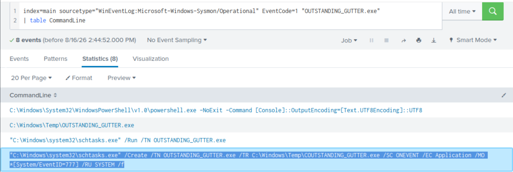

---

### Q5 — Execution as SYSTEM

**Question:**
What permissions will the suspicious binary run as, and what command was used to run it?

**Investigation:**
The scheduled task from Q4 contained `/RU SYSTEM`, indicating execution under the `SYSTEM` account. The decoded command also contained the `/Run` action.

**Finding:**

```text
User: NT AUTHORITY\SYSTEM
Command: "C:\Windows\system32\schtasks.exe" /Run /TN "OUTSTANDING_GUTTER.exe"
```

**Answer:**

```text
NT AUTHORITY\SYSTEM;"C:\Windows\system32\schtasks.exe" /Run /TN "OUTSTANDING_GUTTER.exe"
```

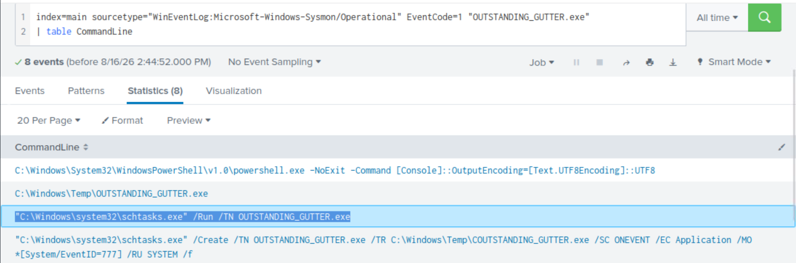

---

### Q6 — Remote Server

**Question:**
What address did the suspicious binary connect to?

**Investigation:**
The second suspicious domain discovered during the DNS investigation was associated with the binary's remote communication.

**Finding:**

```text
9030-181-215-214-32.ngrok.io
```

**Answer:** `hxxp[://]9030-181-215-214-32[.]ngrok[.]io`

---

### Q7 — PowerShell Script

**Question:**
A PowerShell script was downloaded to the same location as the suspicious binary. What was its name?

**Investigation:**
I searched Sysmon **Event ID 11 (File Creation)** for `.ps1` files created under `C:\Windows\Temp\`.

**Query:**

```spl
index=main sourcetype="WinEventLog:Microsoft-Windows-Sysmon/Operational" EventCode=11 .ps1
| where like(TargetFilename, "C:\\Windows\\Temp\\%")
| table TargetFilename
```

**Finding:**

```text
C:\Windows\Temp\script.ps1
```

**Answer:** `script.ps1`

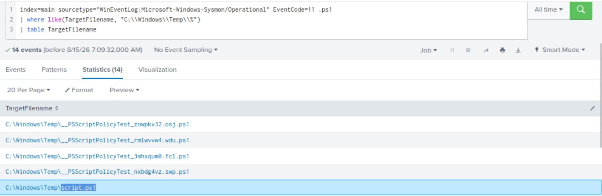

---

### Q8 — Actual Malware Name

**Question:**
The malicious script was flagged as malicious. What was its actual name?

**Investigation:**
I retrieved the SHA-256 hash associated with `script.ps1` and searched it on VirusTotal.

**Finding:**

VirusTotal identified the script as:

```text
BlackSun.ps1
```

**Answer:** `BlackSun.ps1`

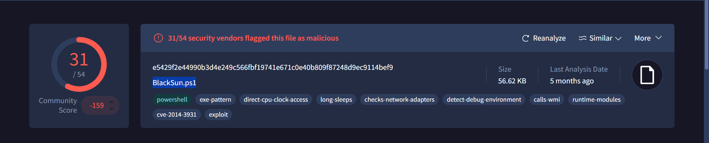

---

### Q9 — Ransomware Note

**Question:**
What is the full path to which the ransom note was saved?

**Investigation:**
I searched Sysmon file creation events for `.txt` files.

**Query:**

```spl
index=main sourcetype="WinEventLog:Microsoft-Windows-Sysmon/Operational" .txt
| table TargetFilename
```

**Finding:**

```text
C:\Users\keegan\Downloads\vasg6b0wmw029hd\BlackSun_README.txt
```

**Answer:** `C:\Users\keegan\Downloads\vasg6b0wmw029hd\BlackSun_README.txt`

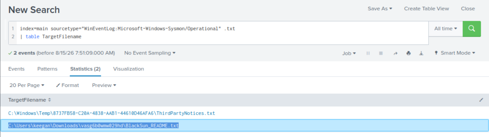

---

### Q10 — Ransomware Wallpaper

**Question:**
What is the full path of the image saved to replace the user's wallpaper?

**Investigation:**
I searched Sysmon file creation events for `.jpg` files.

**Query:**

```spl
index=main sourcetype="WinEventLog:Microsoft-Windows-Sysmon/Operational" .jpg
| table TargetFilename
```

**Finding:**

```text
C:\Users\Public\Pictures\blacksun.jpg
```

**Answer:** `C:\Users\Public\Pictures\blacksun.jpg`

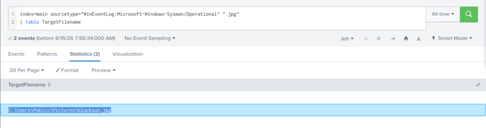

---
## Additional Investigation

During the investigation, I also identified an encoded PowerShell command associated with the malicious activity. I decoded the command using CyberChef to understand its behavior.

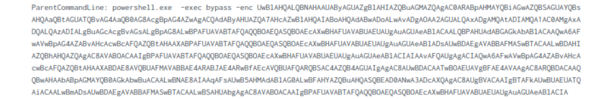

The decoded command revealed the use of `schtasks.exe` to run `OUTSTANDING_GUTTER.exe` with elevated privileges.

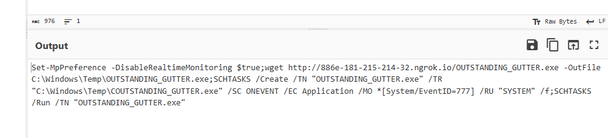

## Attack Chain

```text
Encoded PowerShell
       ↓
Download OUTSTANDING_GUTTER.exe
       ↓
Create scheduled task
       ↓
Execute as SYSTEM
       ↓
Connect to remote ngrok server
       ↓
Download script.ps1
       ↓
Identified as BlackSun.ps1
       ↓
Ransomware activity
       ↓
Ransom note + malicious wallpaper
```

---

## Key IOCs

| Type              | Indicator                               |
| ----------------- | --------------------------------------- |
| Binary            | `OUTSTANDING_GUTTER.exe`                |
| Script            | `BlackSun.ps1`                          |
| Downloaded Script | `script.ps1`                            |
| Download Domain   | `886e-181-215-214-32.ngrok.io`          |
| Remote Server     | `9030-181-215-214-32.ngrok.io`          |
| Ransom Note       | `BlackSun_README.txt`                   |
| Wallpaper         | `C:\Users\Public\Pictures\blacksun.jpg` |
| Execution Account | `NT AUTHORITY\SYSTEM`                   |

---

## Key Takeaways

* **Sysmon Event ID 22** helped identify suspicious DNS activity.
* **Event ID 1** revealed process execution and the `schtasks.exe` command.
* **Event ID 11** helped identify files created by the malicious activity.
* Base64-encoded PowerShell commands can hide malicious actions and should be decoded during investigation.
* `schtasks.exe` can be abused to execute malicious programs with elevated privileges.
* Ransom notes and modified wallpapers can provide useful IOCs.
* Correlating multiple Sysmon events provides a clearer picture of the attack chain.

---

## Conclusion

The investigation confirmed ransomware-related activity on Keegan's machine.

The attack involved an encoded PowerShell command downloading `OUTSTANDING_GUTTER.exe`, creating a scheduled task running as `SYSTEM`, communicating with an external server, and downloading the malicious **BlackSun.ps1** script.

The creation of `BlackSun_README.txt` and `blacksun.jpg` provided additional evidence of the ransomware activity.
